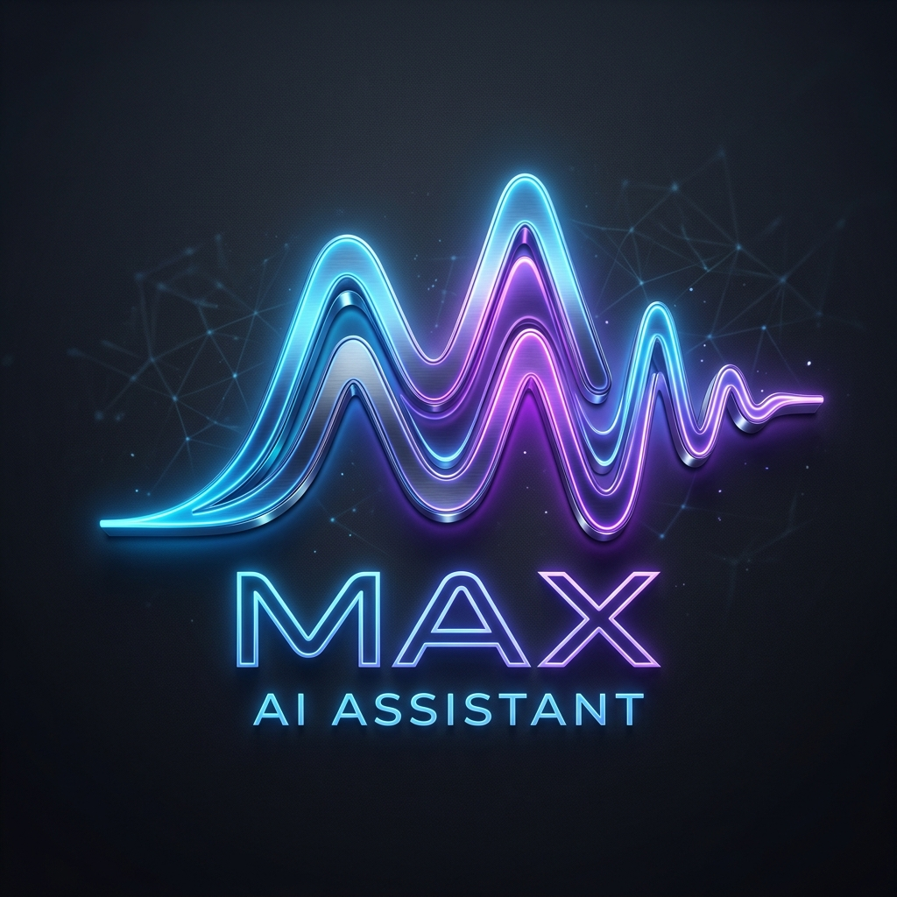
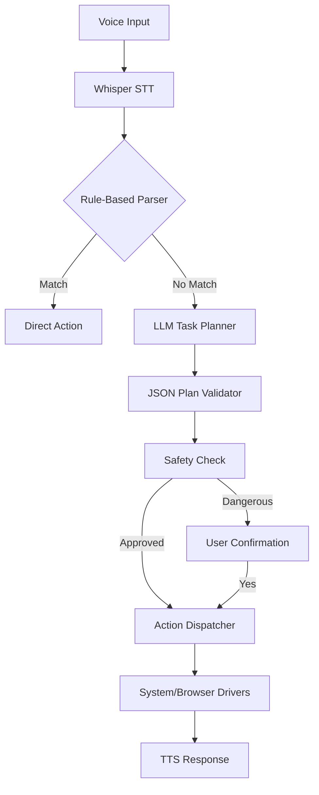

<h1 align="center">
  <br>
  🧠 MAX — AI Voice-Controlled Windows Agent
</h1>

<p align="center">
  
  
  
  
</p>

---
## UPDATE

v2 brings a lot of new things soon.
---

**Max** is a high-performance, full-featured AI-powered Windows orchestration engine with a voice interface. It transforms your desktop into an intelligent assistant that listens for the wake word **"Max"**, converts natural language into structured action plans using **Ollama (local)** or **OpenRouter (cloud)**, and executes them with precision — from browser automation to deep system control.

---

## ⚡ Key Features

*   **🎙️ Wake Word Activation** — Say "Max" to wake up your assistant instantly.
*   **🔊 Next-Gen STT/TTS** — Local transcription via `faster-whisper` (GPU-accelerated) and natural speech synthesis.
*   **🤖 Dual-Provider LLM** — Seamlessly switch between local privacy (Ollama) and cloud power (OpenRouter). Includes **automatic fallback** if one provider is offline.
*   **🌐 Real Browser Control** — Automates your existing Chrome instance (including cookies/sessions) via Playwright & CDP.
*   **💾 Persistent Memory** — SQLite-backed conversation history allowing Max to remember your preferences and past tasks.
*   **🛡️ Multi-Layer Safety** — Integrated plan validator, protected paths, and "Safe Mode" confirmation dialogs for destructive actions.
*   **⚙️ Deep System Orchestration**:
    *   **App Lifecycle**: Launch, focus, and close any Windows application.
    *   **Connectivity**: Control WiFi and Bluetooth states directly.
    *   **Power Management**: Sleep, Lock, Shutdown, and Restart.
    *   **Media & Sound**: Precise volume control, muting, and media playback.
    *   **Clipboard**: Coordinate between your desktop and the AI (Copy/Paste/Clear).
    *   **Environment**: Screen brightness, battery status, and toast notifications.
*   **👁️ Visual Intelligence** — Screen capture with OCR (EasyOCR) to "see" what's on your display.
*   **🖥️ Professional GUI** — Dark-themed PyQt6 interface with real-time logs and status indicators.

---

## 🛠️ Requirements

- **Windows 10 or 11**
- **Python 3.14** (recommended) or 3.13+
- **NVIDIA GPU** (RTX 30 series or better recommended) for near-instant speech processing.
- **Google Chrome** (for browser automation).
- **LLM Account(s)**:
  - [OpenRouter API Key](https://openrouter.ai/keys) (Free models available)
  - [Ollama](https://ollama.ai) (For local offline execution)

---

## 🚀 Installation

### 1. Clone & Setup
```powershell
git clone https://github.com/rehan1020/Max-The-AI-powered-Personal-Assistant-.git
cd Max-The-AI-powered-Personal-Assistant-
py -3.14 -m venv .venv
.\.venv\Scripts\Activate.ps1
pip install -r requirements.txt
playwright install chromium
```

### 2. Configure Environment
Copy `.env.example` to `.env` and fill in your keys:
```env
LLM_PROVIDER=auto
OPENROUTER_API_KEY=your_key_here
OPENROUTER_MODEL=google/gemini-2.0-flash-exp:free # High speed free model
WAKE_WORD=max
```

### 3. Launch
```powershell
python main.py
```

---

## 🎮 How to Use

| Context | Example Commands |
|---|---|
| **Browsing** | "Max, open YouTube and search for 4K drone footage" |
| **System** | "Max, set volume to 50% and turn off WiFi" |
| **Apps** | "Max, launch VS Code and open Notepad" |
| **Files** | "Max, create a folder called 'Invoices' on my desktop" |
| **Intelligence** | "Max, what's currently on my screen?" |
| **Productivity** | "Max, copy the text 'Update the docs' to my clipboard" |

---

## 🏗️ Architecture

Max uses a deterministic pipeline designed for speed and reliability:



Detailed technical documentation can be found in:
- [COMMANDS.md](COMMANDS.md) — Comprehensive command dictionary.
- [SAFETY_ARCHITECTURE.md](SAFETY_ARCHITECTURE.md) — Security and protection layers.
- [PLATFORM_NOTES.md](PLATFORM_NOTES.md) — Windows-specific implementation details.
- [IMPROVEMENTS.md](IMPROVEMENTS.md) — Recent updates and version history.

---

## ⚖️ License

Distributed under the MIT License. See `LICENSE` for more information.

---

<p align="center">
  Built with ❤️ for the Windows automation community.
</p>
